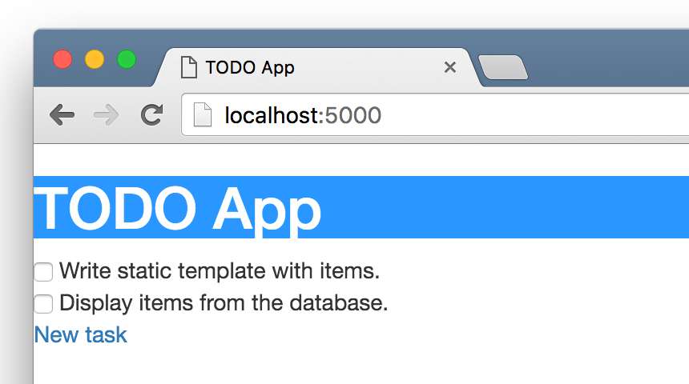
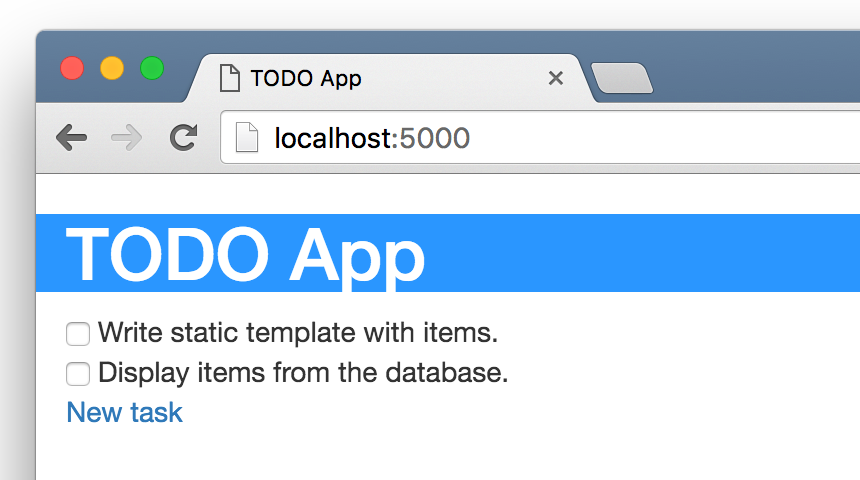
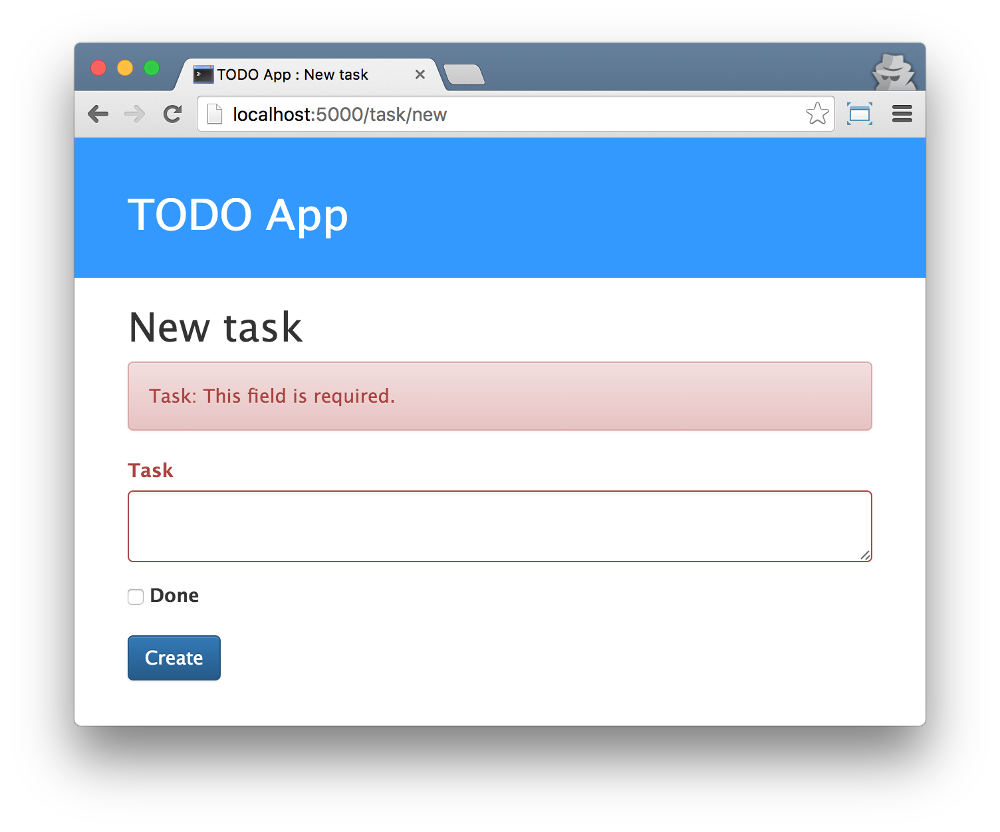
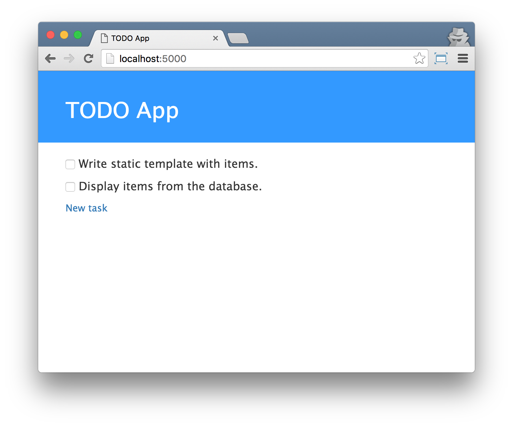

===================
Make app look fancy
===================

Our application still looks pretty ugly, right?
Time to make it nice! We will use CSS for that.

What is CSS?
============

Cascading Style Sheets (CSS) is a language used for describing the look
and formatting of a website written in markup language (like HTML).
Treat it as make-up for our webpage.

But we don't want to start from scratch again, right?
Once more, we'll use something that programmers released on the
Internet for free. You know, reinventing the wheel is no fun.

Let's use Bootstrap!
====================

Bootstrap is one of the most popular HTML and CSS frameworks for
developing beautiful websites: http://getbootstrap.com/

It was written by programmers who worked for Twitter.
Now it's developed by volunteers from all over the world!

Install Bootstrap
=================

To install Bootstrap, you need to add this to your ``<head>`` in your
``layout.html`` file::

    <link rel="stylesheet" href="https://maxcdn.bootstrapcdn.com/bootstrap/3.3.6/css/bootstrap.min.css"
          integrity="sha384-1q8mTJOASx8j1Au+a5WDVnPi2lkFfwwEAa8hDDdjZlpLegxhjVME1fgjWPGmkzs7"
          crossorigin="anonymous">
    <link rel="stylesheet" href="https://maxcdn.bootstrapcdn.com/bootstrap/3.3.6/css/bootstrap-theme.min.css"
          integrity="sha384-fLW2N01lMqjakBkx3l/M9EahuwpSfeNvV63J5ezn3uZzapT0u7EYsXMjQV+0En5r"
          crossorigin="anonymous">

This doesn't add any files to your project. It just points to files that
exist on the internet. Just go ahead, open your website and refresh the page.
Here it is!

.. image:: image/screenshot/flask-bootstrap-1.png

Static files in Flask
=====================

Dynamic web applications also need static files.
That’s usually where the CSS and JavaScript files are coming from.
Ideally your web server is configured to serve them for you,
but during development Flask can do that as well.

Just create a folder called ``static`` in your package or next
to your module and it will be available at ``/static`` on the application.

Your first CSS file
===================

Let's create a CSS file now, to add your own style to your web-page.
Create a new file called ``style.css`` inside this ``css`` directory. Ready?

Time to write some CSS! Open up the ``static/style.css`` file in your
code editor.

We won't be going too deep into customizing and learning about CSS here.
It's pretty easy and you can learn it on your own after this workshop.

.. todo:: There is a recommendation for a free course to learn more at
    the end of this page.

But let's do at least a little. Maybe we could change the color of our header?
To understand colors, computers use special codes.
These codes start with # followed by 6 letters (A-F) and numbers (0-9).
For example, the code for blue is #0000FF.
You can find the color codes for many colors here: http://www.colorpicker.com/.
You may also use predefined colors, such as ``red`` and ``green``.

In your ``static/style.css`` file you should add the following code:

.. code-block:: css

    header {
        background-color: #3399ff;
    }

    header a {
        color: #ffffff;
    }

``header a`` is a CSS Selector. This means we're applying our styles to
any ``a`` element inside of an ``header`` element.
So when we have something like:
``<header><h1><a href="">Title</a></h1></header>``
the ``a`` a style will apply. In this case, we're telling it to change
its text color to ``#ffffff``, which is white.
Of course, you can put your own color here!

In a CSS file we determine styles for elements in the HTML file.
The first way we identify elements is with the element name. Y
ou might remember these as tags from the HTML section.
Things like ``a``, ``h1``, and ``body`` are all examples of element names.

We also identify elements by the attribute class or the attribute id.
Class and id are names you give the element by yourself.
Classes define groups of elements, and ids point to specific elements.
For example, you could identify the following tag by using the tag name ``a``,
the class ``external_link``, or the id ``link_to_wiki_page``:

.. code-block:: html

    <a href="http://en.wikipedia.org/wiki/Flask"
       class="external_link" id="link_to_wiki_page">
    Flask
    </a>

Then, we need to also tell our HTML template that we added some CSS.
Open the ``templates/layout.html`` file and add this line between
the ``<head>`` and ``</head>``, after the links to the Bootstrap CSS
files add this line::

    <link rel="stylesheet" href="{{ url_for('static', filename='style.css') }}" />

The browser reads the files in the order they're given,
so we need to make sure this is in the right place.
Otherwise the code in our file may override code in Bootstrap files.
We just told our template where our CSS file is located.

OK, save the file and refresh the site!

Nice work! Maybe we would also like to give our website a little air
and increase the margin on the left side? Let's try this!

.. code-block:: css

    header, section#body {
        padding-left: 15px;
    }

Add this to your CSS, save the file and see how it works!

As mentioned above, CSS has a concept of classes.
These allow you to name a part of the HTML code and apply styles only
to this part, without affecting other parts. This can be super helpful!
Maybe you have two divs that are doing something different
A class can help you make them look different.

We will now add declaration blocks to different selectors.
Selectors starting with ``.`` relate to classes.
There are many great tutorials and explanations about CSS on the Web
to help you understand the following code.
For now, just copy and paste it into your ``static/style.css`` file:

.. code-block:: css

    body {
        font-family: 'Lucida Grande', 'Lucida Sans Unicode', 'Geneva',
                     'Verdana', sans-serif;
    }

    header{
        background-color: #3399ff;
        margin-top: 0;
        padding: 20px 40px 20px 40px;
    }

    header h1, header h1 a, header h1 a:visited, header h1 a:active {
        color: #ffffff;
        font-size: 24pt;
        text-decoration: none;
    }

    section#body {
        margin: 20px 40px 20px 40px;
    }

    .task {
        margin: 10px 0 10px 0;
        font-size: 1.2em;
    }

You also need to add classes to your ``task_edit.html`` template:

.. code-block:: html
    
    

     : New task

    
        <h2>New task</h2>
        <form method="POST" action="">
            
            

            
                
                
{{ form[field].label.text }}: {{ error }}

                
            
            

            
            

                {{ form.content.label(class_='control-label') }}
                {{ form.content(class_='form-control') }}
            

            

                {{ form.is_done }}
                {{ form.is_done.label(class_='control-label') }}
            

            <input class="btn btn-primary" type="submit" value="Create" />
        </form>
    

Now refresh your page ange check the result:

