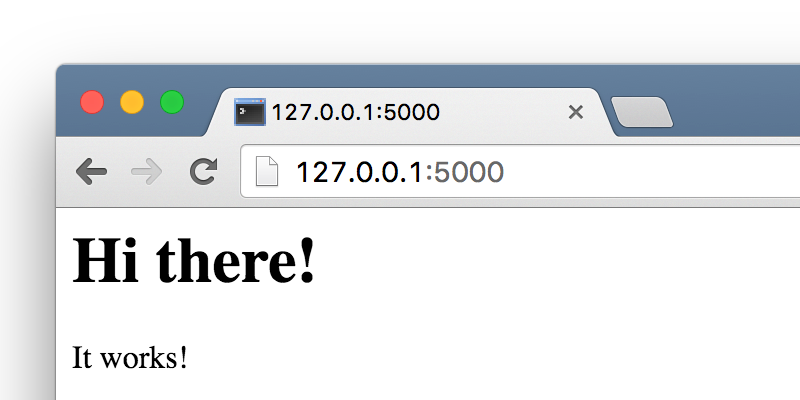

===============
Flask templates
===============

A template is a file that we can re-use to present different information
in a consistent format - for example, you could use a template to help
you write a letter, because although each letter might contain a different
message and be addressed to a different person, they will share
the same format.

A Flask template's format is described in a language called HTML.

What's HTML?
============

HTML is a simple code that is interpreted by your web browser - such as Chrome,
Firefox or Safari - to display a webpage for the user.

HTML stands for "HyperText Markup Language". HyperText means it's a type of
text that supports hyperlinks between pages. Markup means we have taken a
document and marked it up with code to tell something (in this case, a browser)
how to interpret the page. HTML code is built with tags, each one starting
with < and ending with >. These tags represent markup elements.

Your first template
===================

Creating a template means creating a template file.
Everything is a file, right? You have probably noticed this already.

Templates are saved in ``templates`` directory.
So create directory ``templates`` near your ``app.py`` file.
Now create file ``templates/index.html`` and add the following code to your
template file:

.. code-block:: html

   <html>
       <h1>Hi there!</h1>
       
It works!

   </html>

Now we need tell Flask to display this template. Update your ``app.py``:

.. code-block:: python
   :emphasize-lines: 2,9

   from flask import Flask
   from flask import render_template

   app = Flask(__name__)

   @app.route('/')
   def index():
       return render_template('index.html')

   if __name__ == '__main__':
       app.run()

Now run ``app.py`` and see how your website looks now: http://127.0.0.1:5000/

It worked! Nice work there :)

* The most basic tag, ``<html>``, is always the beginning of any webpage
  and ``</html>`` is always the end. As you can see, the whole content
  of the website goes between the beginning tag ``<html>`` and closing tag
  ``</html>``.
* ``
`` is a tag for paragraph elements; ``
`` closes each paragraph.

Head & body
===========

Each HTML page is also divided into two elements: **head** and **body**.

* **head** is an element that contains information about the document that
  is not displayed on the screen.
* **body** is an element that contains everything else that is displayed
  as part of the web page.

We use ``<head>`` to tell the browser about the configuration of the page,
and ``<body>`` to tell it what's actually on the page.

For example, you can put a webpage title element inside the <head>, like this:

.. code-block:: html

   <html>
   <head>
       <title>My First Template</title>
   </head>
   <body>
       <h1>Hi there!</h1>
       
It works!

   </body>
   </html>

.. image:: image/screenshot/flask-first-template-2.png

Notice how the browser has understood that "My First template" is the title
of your page? It has interpreted ``<title>My First Template</title>``
and placed the text in the title bar of your browser
(it will also be used for bookmarks and so on).

Probably you have also noticed that each opening tag is matched
by a closing tag, with a /, and that elements are nested
(i.e. you can't close a particular tag until all the ones that were
inside it have been closed too).

It's like putting things into boxes. You have one big box, ``<html></html>``;
inside it there is ``<body></body>``, and that contains still smaller boxes:
``

``.

You need to follow these rules of closing tags, and of nesting
elements - if you don't, the browser may not be able to interpret
them properly and your page will display incorrectly.

A complete example
==================

.. code-block:: html

   <!DOCTYPE html>
   <html lang="en">
   <head>
       <meta charset="UTF-8">
       <title>My First Template</title>
   </head>
   <body>
       <h1>Hi there!</h1>
       
It works!

   </body>
   </html>

.. todo:: Add explanation (DOCTYPE, meta charset, html language)

