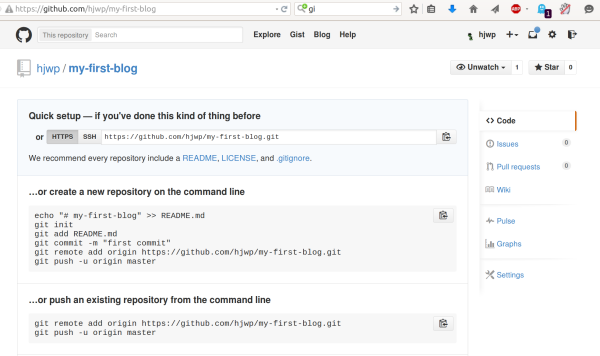

===================
Introduction to Git
===================

.. note::
    Content in this chapter was borrowed from the tutorial: https://git-scm.com/
    and Django Girls: http://tutorial.djangogirls.org/en/

The basic Git workflow goes something like this:

* You modify files in your working directory.
* You stage the files, adding snapshots of them to your staging area.
* You do a commit, which takes the files as they are in the staging area and
  stores that snapshot permanently to your Git directory.

Git installation
================

**Git** is a widely used `source code management system <https://en.wikipedia.org/wiki/Version_control_system>`_
for `software development <https://en.wikipedia.org/wiki/Software_development>`_.

**Git** was initially designed and developed in 2005 by Linux kernel developers
(including Linus Torvalds) for Linux kernel development.

Windows
-------

You can download and install Git from the official web-cite `<https://git-scm.com/>`_
and follow the steps.

**Attention** in the 5th step "Adjusting your PATH environment", choose
*"Run Git and associated Unix tools from the Windows command-line"* (the bottom option).
Other than that, the defaults are fine. Checkout Windows-style, commit Unix-style
line endings is good.

OS X
-----

You may download from the official web-site `<https://git-scm.com/>`_

GNU/Linux
---------

If it isn't installed already, should be available via your package manager::

    $ sudo apt-get install git

Starting Git repository
=======================

Initializing a Repository
-------------------------
.. note::
    Check your current working directory with a *pwd* (OSX or GNU/Linux) or
    *cd* (Windows) command before initializing the repository. You should be in
    the <your-name-of-project> folder.

If you’re starting an existing project in Git, you need to go to the project’s
directory and type::

    $ git init

Initializing the git repository is something we only need to do once per project.

Your Identity
-------------
The first thing you should do when you install Git is to set your user name and
e-mail address. This is important because every Git commit uses this information::

    $ git config --global user.name "Your Name"
    $ git config --global user.email you@example.com

Your Editor
-----------

By default, Git uses your system’s default editor, which is generally *Vi* or *Vim*.
If you want to change::

    $ git config --global core.editor emacs

Getting Help
------------
If you ever need help while using Git::

    $ git help <verb>
    $ git <verb> --help
    $ man git-<verb>

Ignoring Files
--------------

Git will track changes to all the files and folders in this directory, but
there are some files we want it to ignore. We do this by creating a file
called ``.gitignore`` in the ``FlaskWorkshop`` directory.

Open up your editor and create a new file with the following contents::

    *.pyc
    __pycache__
    myvenv
    /static
    .DS_Store

And save it as ``.gitignore`` in the ``FlaskWorkshop`` folder.

Checking Status of Your Files
-----------------------------

It's a good idea to use a ``git status`` command before ``git add``.
This will help stop any surprises from happening, such as wrong files being
added or commited::

    $ git status
    On branch master
    Your branch is up-to-date with 'origin/master'.
    nothing to commit, working directory clean

    $ git add *filename*

After this you may see::

    $ git status
    On branch master
    Your branch is up-to-date with 'origin/master'.
    Changes to be committed:
      (use "git reset HEAD &lt;file&gt;..." to unstage)

        new file:   *filename*

Committing Your Changes
-----------------------

The simplest way to commit is to type ``git commit``::

    $ git commit

Create a GitHub account
=======================

You should go to `GitHub <https://github.com/>`_ and sign up account.

Then, create a new repository, gives a *your-name-of-project*. Leave the
"initialise with a README" tickbox *un-checked*, leave the ``.gitignore`` option
blank (we've done that manually) and leave the License as *None*.

On the next screen, you'll be shown your repo's clone URL.
Choose the "HTTPS" version, copy it, and we'll paste it into the terminal shortly:

Now we need to hook up the Git repository on your computer to the one up on GitHub.

Type the following into your console (Replace *<your-github-username>* with the
username you entered when you created your GitHub account, but without
the angle-brackets)::

    $ git remote add origin https://github.com/<your-github-username>/<your-name-of-project>.git
    $ git push -u origin master

Enter your GitHub username and password and you should see something like this::

    Username for 'https://github.com': hjwp
    Password for 'https://hjwp@github.com':
    Counting objects: 6, done.
    Writing objects: 100% (6/6), 200 bytes | 0 bytes/s, done.
    Total 3 (delta 0), reused 0 (delta 0)
    To https://github.com/hjwp/<your-name-of-project>.git
     * [new branch]      master -> master
    Branch master set up to track remote branch master from origin.

Your code is now on GitHub. Go and check it out!

