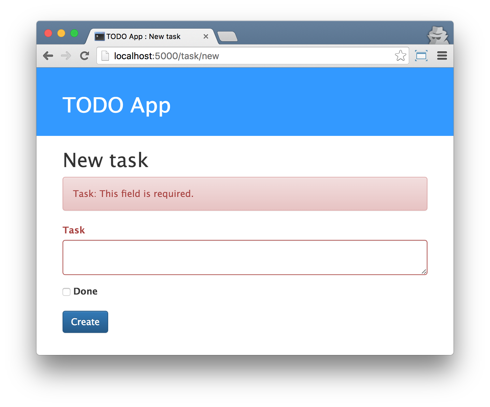

============
Introduction
============

We have good news for you. Programming is not as hard as it seems and we want to
show you how fun and informative it can be.

The tutorial will not magically to turn you into a programmer. If you want to be
good at it, you need months or even years of learn and practice. But we want to
show you that programming or creating web applications is not as complicated as
it seems.

We will try to explain different bits and pieces as well as we can, so you will
not feel intimidated by technology.

What will you learn during the tutorial?
----------------------------------------

When you finish this tutorial, you will have a simple and working "TODO" web
application. You will learn how to make it available in the Internet, so will be
able to share your work with your friends and family.

