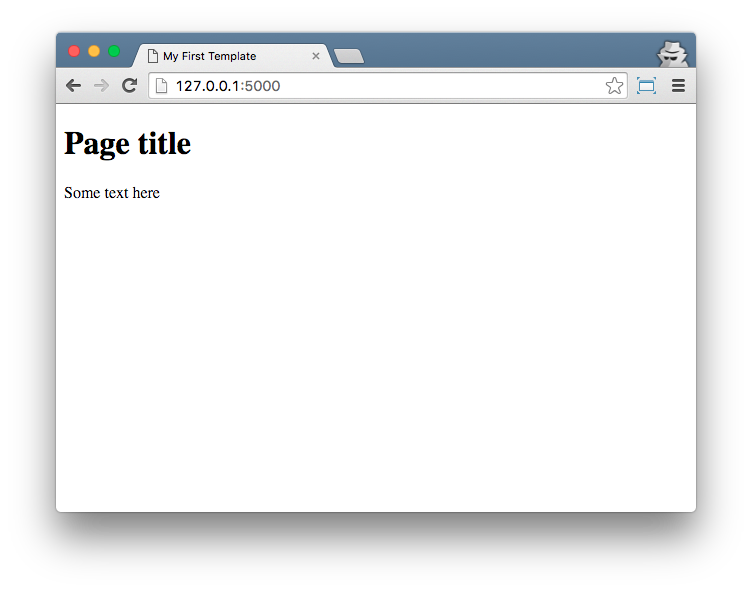

===============
Flask templates
===============

A template is a file that we can re-use to present different information
in a consistent format - for example, you could use a template to help
you write a letter, because although each letter might contain a different
message and be addressed to a different person, they will share
the same format.

A Flask template's format is described in a language called HTML.

What's HTML?
============

HTML is a simple code that is interpreted by your web browser - such as Chrome,
Firefox or Safari - to display a webpage for the user.

HTML stands for "HyperText Markup Language". HyperText means it's a type of
text that supports hyperlinks between pages. Markup means we have taken a
document and marked it up with code to tell something (in this case, a browser)
how to interpret the page. HTML code is built with tags, each one starting
with < and ending with >. These tags represent markup elements.

Your first template
===================

Creating a template means creating a template file.
Everything is a file, right? You have probably noticed this already.

Templates are saved in ``templates`` directory.
So create directory ``templates`` near your ``app.py`` file.
Now create file ``templates/index.html`` and add the following code to your
template file:

.. code-block:: html

   <html>
       <h1>Hi there!</h1>
       
It works!

   </html>

.. code-block:: html

   <!DOCTYPE html>
   <html lang="en">
   <head>
       <meta charset="UTF-8">
       <title>My First Template</title>
   </head>
   <body>
       <h1>Hi there!</h1>
       
It works!

   </body>
   </html>

To display this code update your ``app.py``.

.. code-block:: python
   :emphasize-lines: 2,9

   from flask import Flask
   from flask import render_template

   app = Flask(__name__)

   @app.route('/')
   def index():
       return render_template('index.html')

   if __name__ == '__main__':
       app.run()

Now run ``app.py`` and check the result in your browser. The page should look
similar to this example:

.. todo:: Add explanation