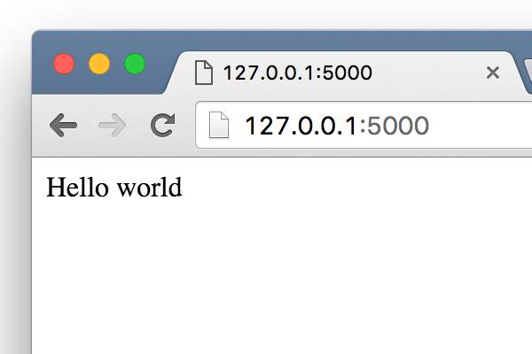

=========================
Writing first application
=========================

Create directory ``FlaskWorkshop`` and go to this directory.

Crete a new file ``app.py`` with contents:

.. code-block:: python

    from flask import Flask

    app = Flask(__name__)

    @app.route('/')
    def index():
        return 'Hello world'

    if __name__ == '__main__':
        app.run()

It's an example of minimal Flask application. Simple isnt't it?

Now you can run it and check how it works::

    $ python app.py

You should see the following message in the console::

    * Running on http://127.0.0.1:5000/ (Press CTRL+C to quit)

It means that your application is available by URL ``http://127.0.0.1:5000``.
So simply copy this URL to your brouwser and you will see the page:

What happens here?
==================

So you've created your very first working web application. Let's take a look
at the source code line by line and check how it works.

#. This is the import statement::

        from flask import Flask

   It imports ``Flask`` class that helps you to configure your application.
   It is the main class in the Flask framework. Every Flask application
   should have one Flask class instance.

#. We created an instance of class ``Flask`` and name it ``app``::

        app = Flask(__name__)

#. We added handler for the main page of your web application::

    @app.route('/')
    def index():
        return 'Hello world'

   The function ``index`` will be called each time when somebody opens the
   main page of your web application. ``@app.route('/')`` is a decorator,
   that registers function ``index`` as a request handler. So from now Flask
   will know, that for all requests to ``/`` path it should call function
   ``index``.

# TODO: Describe the following log:

::

    * Running on http://127.0.0.1:5000/ (Press CTRL+C to quit)
    127.0.0.1 - - [29/Mar/2016 14:46:53] "GET / HTTP/1.1" 200 -
    127.0.0.1 - - [29/Mar/2016 14:46:54] "GET /favicon.ico HTTP/1.1" 404 -